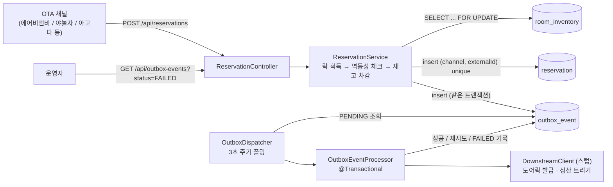

# reservation-integrity-service

여러 OTA 채널에서 동시에 들어오는 예약 웹훅을 오버부킹 없이, 중복 없이 안전하게 반영하는 백엔드 서비스.

문제 정의는 [PROBLEM.md](./PROBLEM.md), 설계는 [DESIGN.md](./DESIGN.md) 참고.

## 아키텍처



**데이터 모델**: `room_inventory`↔`reservation`은 `room_type_id`+`stay_date`로만 연관되는 논리적 관계고(FK 아님), `outbox_event`→`reservation`만 실제 FK다. 상세 스키마는 [DESIGN.md](./DESIGN.md#데이터-모델) 참고.

## 실행 방법

```bash
docker-compose up -d   # 로컬 PostgreSQL 기동
./gradlew bootRun      # http://localhost:8080
```

## 테스트 실행

동시성/멱등성 통합 테스트는 실제 PostgreSQL이 필요하므로, 반드시 `docker-compose up -d`를 먼저 실행해야 합니다.

```bash
docker-compose up -d
./gradlew test
```

총 13개 테스트(6개 클래스): 핵심 로직 단위 테스트 5, REST API 통합 테스트 4,
동시성/멱등성 증명 테스트 2, Outbox 재시도 테스트 1, 리포지토리 스모크 테스트 1.

동시성 증명 테스트 1건은 재고 1개를 두고 50개 요청을 동시에 보내 정확히 1건만 성공하는지,
멱등성 증명 테스트 1건은 같은 웹훅 20개를 동시에 보내 정확히 1건만 반영되는지를
실제 PostgreSQL로 검증한다 (자세한 내용은 [DESIGN.md](./DESIGN.md#테스트-전략) 참고).

## API 사용 예시

```bash
# 예약 확정 웹훅 시뮬레이션 (V2__seed_data.sql에 DELUXE_A/2026-08-10 재고 5개가 미리 들어있음)
curl -X POST http://localhost:8080/api/reservations \
  -H "Content-Type: application/json" \
  -d '{"channel":"AIRBNB","externalReservationId":"AB-1","roomTypeId":"DELUXE_A","stayDate":"2026-08-10"}'

# 같은 웹훅 재전송 → 200 ALREADY_PROCESSED
curl -X POST http://localhost:8080/api/reservations \
  -H "Content-Type: application/json" \
  -d '{"channel":"AIRBNB","externalReservationId":"AB-1","roomTypeId":"DELUXE_A","stayDate":"2026-08-10"}'

# 후속 처리 강제 실패 시뮬레이션 → outbox 재시도 후 FAILED로 추적됨
curl -X POST http://localhost:8080/api/reservations \
  -H "Content-Type: application/json" \
  -d '{"channel":"AIRBNB","externalReservationId":"AB-2","roomTypeId":"DELUXE_A","stayDate":"2026-08-10","simulateDownstreamFailure":true}'

# 최종 실패한 후속 처리 추적
curl http://localhost:8080/api/outbox-events?status=FAILED
```

## AI 활용

이 프로젝트의 설계 논의와 AI 협업 과정은 [DESIGN.md](./DESIGN.md#ai-협업-과정)에 정리되어 있습니다.
